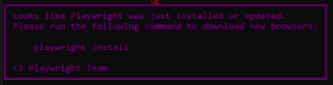

# README.md

# PyQuotex
<p>
<a target="_blank">
  
</a>
<br>
<a target="_blank">
    
</a>
</p>


# About the PyQuotex Library

This library was developed with the purpose of facilitating communication with the Quotex platform through WebSockets, enabling real-time data retrieval and the automation of operations. **It is important to note that this library is not a trading bot, nor does it intend to be**.
To access more features and greater stability, consider joining the private version.

## Library Objective

The main goal of this library is to provide the necessary tools for developers to integrate their applications with the Quotex platform, automating specific operations in a safe and efficient manner.

## Automation Implementation

Any additional automation, including the creation of automatic bots that make trading decisions, must be implemented by the developer who chooses to use this library in their projects. The responsibility for these additional implementations lies entirely with the developer.

## Disclaimer

As the developer of this library, **I am not responsible for any malfunction or application failure** that may occur due to improper use of the library or the implementation of automations that go beyond the original scope of this tool.

If you decide to use this library, it is crucial that you carefully analyze and rigorously test your implementations to ensure that they meet your needs and expectations.

# Notice about Support and Discussions

Due to the high volume of messages seeking information and support, and considering that I am just one person and do not have the time to assist everyone individually, **I have created a [discussion group on Telegram](https://t.me/+Uzcmc-NZvN4xNTQx)**.

This group was created so that members can help each other, ask questions, and collaborate with others who are also using this library. Your participation and interaction in the group are highly encouraged, as this way everyone can benefit from the collective experience.

Feel free to join the group and contribute with your questions and knowledge.

### Important note
For some reason, cloudflare ends up identifying automated access to the quotex API and we
applies a block, which prevents successful authentication on the platform using a user
and password, I recommend using Python 3.8 or higher to be successful with this API.
For Windows users it is necessary to install the latest possible openssl, which can be obtained
here [Openssl-Windows](https://slproweb.com/products/Win32OpenSSL.html) .
For Linux users, the latest possible versions of openssl are also recommended, simply
just run ```sudo apt install openssl```.

## Let`s Go to the Private Repository
[](https://www.buymeacoffee.com/cleiton.leonel)

## Support with Cryptocurrency

You can support this project by sending cryptocurrency to the addresses below. Every contribution is appreciated!

### Dogecoin (DOGE) 
`DMwSPQMk61hq49ChmTMkgyvUGZbVbWZekJ`  

### Bitcoin (BTC)   
`bc1qtea29xkpyx9jxtp2kc74m83rwh93vjp7nhpgkm`  

### Ethereum (ETH)   
`0x20d1AD19277CaFddeE4B8f276ae9f3E761523223`

### Solana (SOL) 
`4wbE2FVU9x4gVErVSsWwhcdXQnDBrBVQFvbMqaaykcqo`  

Thank you for your support! 🚀


### Showcase

https://github.com/user-attachments/assets/acaa0cbb-80c2-450c-9c8f-83fdbfedf0fa

### Install Poetry
Installing with the official [installer](https://python-poetry.org/docs/#installing-with-the-official-installer)


### Clone and Install

If you choose this method, do not use the next poetry installation step, skip it.

```shell
git clone https://github.com/cleitonleonel/pyquotex.git
cd pyquotex
poetry install
poetry run python app.py
```


### Install with poetry in your project

If you didn't install via git clone, use poetry for that.

```shell
poetry add git+https://github.com/cleitonleonel/pyquotex.git
```

### 📖 How to Fix the `playwright install` Error



If you encounter the error related to `playwright install` when using this library, follow the steps below to resolve the issue.

## Install Playwright Browsers
Ensure that Playwright and the required browsers are installed.

### Install the compatible browsers:
```bash
playwright install
```

### Import as lib
```python
from quotexapi.stable_api import Quotex

email = "account@gmail.com"
password = "you_password"

client = Quotex(
    email=email,
    password=password
)
```

### Login by email and password
if connect sucess return True,None  

if connect fail return False,None

```python
import os
import sys
import json
import time
import random
import asyncio
from pathlib import Path
from quotexapi.expiration import (
    timestamp_to_date,
    get_timestamp_days_ago
)
from quotexapi.stable_api import Quotex

from quotexapi.utils.processor import process_candles, get_color

USER_AGENT = "Mozilla/5.0 (X11; Ubuntu; Linux x86_64; rv:109.0) Gecko/20100101 Firefox/119.0"

email = "account@gmail.com"
password = "you_password"

client = Quotex(
    email=email,
    password=password,
    lang="pt",  # Default pt -> Português.
)

# client.debug_ws_enable = True


def get_all_options():
    return """Opções disponíveis:
    - test_connection
    - get_profile
    - get_balance
    - get_signal_data
    - get_asset
    - get_payment
    - get_candle
    - get_candle_v2
    - get_candle_progressive
    - get_realtime_candle
    - get_candles_all_asset
    - get_realtime_sentiment
    - assets_open
    - buy_simple
    - buy_and_check_win
    - buy_multiple
    - balance_refill
    - help
    """


async def connect(attempts=5):
    check, reason = await client.connect()
    if not check:
        attempt = 0
        while attempt <= attempts:
            if not client.check_connect():
                check, reason = await client.connect()
                if check:
                    print("Reconnect successfully!!!")
                    break
                else:
                    print("Reconnect error.")
                    attempt += 1
                    if Path(os.path.join(".", "session.json")).is_file():
                        Path(os.path.join(".", "session.json")).unlink()
                    print(f"Reconnecting, attempt {attempt} de {attempts}")
            elif not check:
                attempt += 1
            else:
                break

            await asyncio.sleep(5)

        return check, reason

    print(reason)

    return check, reason


async def test_connection():
    await client.connect()
    is_connected = client.check_connect()
    print(f"Connected: {is_connected}")
    print("Exiting...")
    client.close()


async def get_balance():
    check_connect, message = await client.connect()
    if check_connect:
        # client.change_account("REAL")
        print("Current Balance: ", await client.get_balance())

    print("Exiting...")

    client.close()


async def buy_simple():
    check_connect, message = await client.connect()
    if check_connect:
        # client.change_account("REAL")
        amount = 50
        asset = "AUDCAD"  # "EURUSD_otc"
        direction = "call"
        duration = 60  # in seconds
        asset_name, asset_data = await client.get_available_asset(asset, force_open=True)
        print(asset_name, asset_data)
        if asset_data[2]:
            print("OK: Asset is closing.")
            status, buy_info = await client.buy(amount, asset_name, direction, duration)
            print(status, buy_info)
        else:
            print("ERROR: Asset is closing.")

        print("Current Balance: ", await client.get_balance())

    print("Exiting...")

    client.close()


async def get_result():
    check_connect, reason = await client.connect()
    if check_connect:
        status, operation_info  = await client.get_result('3ca7d99f-744e-4d5b-9780-27e50575290d')
        print(status, operation_info)
    print("Exiting...")

    client.close()


async def get_profile():
    check_connect, message = await client.connect()
    if check_connect:
        # client.change_account("REAL")
        profile = await client.get_profile()
        description = (
            f"\nUsuário: {profile.nick_name}\n"
            f"Balance Demo: {profile.demo_balance}\n"
            f"Balance Real: {profile.live_balance}\n"
            f"Id: {profile.profile_id}\n"
            f"Avatar: {profile.avatar}\n"
            f"Country: {profile.country_name}\n"
        )

        print(description)

    print("Exiting...")

    client.close()


async def balance_refill():
    check_connect, message = await client.connect()
    if check_connect:
        # client.change_account("REAL")
        result = await client.edit_practice_balance(5000)

        print(result)

    client.close()


async def buy_and_check_win():
    check_connect, message = await client.connect()
    if check_connect:
        # client.change_account("REAL")
        print("Current Balance: ", await client.get_balance())
        amount = 50
        asset = "EURUSD_otc"  # "EURUSD_otc"
        direction = "call"
        duration = 60  # in seconds
        asset_name, asset_data = await client.get_available_asset(asset, force_open=True)
        print(asset_name, asset_data)
        if asset_data[2]:
            print("OK: Asset is closing.")
            status, buy_info = await client.buy(amount, asset_name, direction, duration)
            print(status, buy_info)
            if status:
                print("Waiting result...")
                if await client.check_win(buy_info["id"]):
                    print(f"\nWin!!! \nWe win boy!!!\nProfit: R$ {client.get_profit()}")
                else:
                    print(f"\nLoss!!! \nWe lost boy!!!\nLoss: R$ {client.get_profit()}")
            else:
                print("Operation failed!!!")
        else:
            print("ERROR: Asset is closing.")

        print("Profit: ", await client.get_balance())

    print("Exiting...")

    client.close()


async def buy_multiple(orders=10):
    order_list = [
        {"amount": 5, "asset": "EURUSD", "direction": "call", "duration": 60},
        {"amount": 10, "asset": "AUDCAD_otc", "direction": "put", "duration": 60},
        {"amount": 15, "asset": "AUDJPY_otc", "direction": "call", "duration": 60},
        {"amount": 20, "asset": "AUDUSD_otc", "direction": "put", "duration": 60},
        {"amount": 25, "asset": "CADJPY", "direction": "call", "duration": 60},
        {"amount": 30, "asset": "EURCHF_otc", "direction": "put", "duration": 60},
        {"amount": 35, "asset": "EURGBP_otc", "direction": "call", "duration": 60},
        {"amount": 40, "asset": "EURJPY", "direction": "put", "duration": 60},
        {"amount": 45, "asset": "GBPAUD_otc", "direction": "call", "duration": 60},
        {"amount": 50, "asset": "GBPJPY_otc", "direction": "put", "duration": 60},
    ]
    check_connect, message = await client.connect()
    for i in range(0, orders):
        print("\n/", 80 * "=", "/", end="\n")
        print(f"Opening order: {i + 1}")
        order = random.choice(order_list)
        print(order)
        if check_connect:
            # client.change_account("REAL")
            asset_name, asset_data = await client.get_available_asset(order['asset'], force_open=True)
            print(asset_name, asset_data)
            if asset_data[2]:
                print("OK: Asset is closing.")
                status, buy_info = await client.buy(**order)
                print(status, buy_info)
            else:
                print("ERROR: Asset is closing.")
            print("Current Balance: ", await client.get_balance())
            await asyncio.sleep(2)

    print("\n/", 80 * "=", "/", end="\n")

    print("Exiting...")

    client.close()


async def sell_option():
    check_connect, message = await client.connect()
    if check_connect:
        # client.change_account("REAL")
        amount = 30
        asset = "EURUSD_otc"  # "EURUSD_otc"
        direction = "put"
        duration = 1000  # in seconds
        asset_name, asset_data = await client.get_available_asset(asset, force_open=True)
        print(asset_name, asset_data)
        if asset_data[2]:
            print("OK: Asset is closing.")
            status, buy_info = await client.buy(amount, asset_name, direction, duration)
            print(status, buy_info)
            await client.sell_option(buy_info["id"])

        print("Current Balance: ", await client.get_balance())

    print("Exiting...")

    client.close()


def asset_parse(asset: str):
    new_asset = f"{asset[:3]}/{asset[3:]}"
    if "_otc" in asset:
        return new_asset.replace("_otc", " (OTC)")

    return new_asset


async def assets_open():
    check_connect, reason = await client.connect()
    if check_connect:
        print("Asset Open")
        for i in client.get_all_asset_name():
            print(i[1])
            print(i[1], await client.check_asset_open(i[0]))

    print("Exiting...")

    client.close()


async def get_asset():
    check_connect, reason = await client.connect()
    if check_connect:
        asset_data, asset_info = await client.check_asset_open("EURUSD_otc")
        print(asset_data)
        print(asset_info)

    print("Exiting...")

    client.close()


async def get_candle():
    candles_color = []
    check_connect, message = await client.connect()
    if check_connect:
        asset = "CHFJPY_otc"
        offset = 3600  # in seconds
        period = 60  # in seconds [5, 10, 15, 30, 60, 120, 180, 240, 300, 600, 900, 1800, 3600, 14400, 86400]
        end_from_time = time.time()
        candles = await client.get_candles(asset, end_from_time, offset, period)
        candles_data = candles
        if len(candles_data) > 0:

            if not candles_data[0].get("open"):
                candles = process_candles(candles_data, period)
                candles_data = candles

            print(asset, candles_data)

            for candle in candles_data:
                color = get_color(candle)
                candles_color.append(color)

            # print(candles)
            print(candles_color if len(candles_color) > 0 else "")
        else:
            print("No candles.")

    print("Exiting...")

    client.close()


async def get_candle_progressive():
    check_connect, reason = await client.connect()
    if check_connect:
        asset = "EURUSD_otc"
        offset = 3600  # in seconds
        period = 60  # in seconds [5, 10, 15, 30, 60, 120, 180, 240, 300, 600, 900, 1800, 3600, 14400, 86400]
        days_of_candle = 1
        list_candles = []
        size = days_of_candle * 24
        timestamp = get_timestamp_days_ago(days_of_candle)
        end_from_time = (int(timestamp) - int(timestamp) % period) + offset
        epoch_candle = timestamp_to_date(end_from_time)
        print(f"Searching for historical data from {epoch_candle} to now...")
        for i in range(size):
            epoch_candle = timestamp_to_date(end_from_time)
            # print(epoch_candle)
            candles = await client.get_candles(asset, end_from_time, offset, period, progressive=True)
            if candles:
                list_candles += candles
            if i >= size:
                offset *= 2
            end_from_time = end_from_time + offset

        lista_limpa = list({frozenset(d.items()): d for d in list_candles}.values())
        print(lista_limpa, len(lista_limpa))

    print("Exiting...")

    client.close()


async def get_payment():
    check_connect, message = await client.connect()
    if check_connect:
        all_data = client.get_payment()
        for asset_name in all_data:
            asset_data = all_data[asset_name]
            profit = f'\nProfit 1+ : {asset_data["profit"]["1M"]} | Profit 5+ : {asset_data["profit"]["5M"]}'
            status = " ==> Opened" if asset_data["open"] else " ==> Closed"
            print(asset_name, status, profit)
            print("-" * 35)

    print("Exiting...")

    client.close()


async def get_candle_v2():
    check_connect, message = await client.connect()
    if check_connect:
        asset = "EURUSD_otc"
        asset_name, asset_data = await client.get_available_asset(asset, force_open=True)
        print(asset_name, asset_data)
        if asset_data[2]:
            print("OK: Asset is closing.")
            # 60 at 180 seconds
            candles = await client.get_candle_v2(asset_name, 60)
            print(candles)
        else:
            print("ERROR: Asset is closing.")

    print("Exiting...")

    client.close()


async def get_candles_all_asset():
    check_connect, message = await client.connect()
    if check_connect:
        offset = 3600  # in seconds
        period = 60    # in seconds
        codes_asset = await client.get_all_assets()
        for asset in codes_asset.keys():
            asset_name, asset_data = await client.get_available_asset(asset)
            if asset_data[2]:
                print(asset_name, asset_data)
                print("OK: Asset is closing.")
                end_from_time = time.time()
                candles = await client.get_candles(asset, end_from_time, offset, period)
                print(candles)
            await asyncio.sleep(1)

    print("Exiting...")

    client.close()

async def get_realtime_candle():
    check_connect, message = await client.connect()
    if check_connect:
        period = 5  # in seconds [60, 120, 180, 240, 300, 600, 900, 1800, 3600, 14400, 86400]
        asset = "EURUSD_otc"
        asset_name, asset_data = await client.get_available_asset(asset, force_open=True)
        print(asset_name, asset_data)
        if asset_data[2]:
            print("Asset Open")
            while True:
                candles = await client.get_realtime_candles(asset_name, period)
                print(candles)
                await asyncio.sleep(1)
        else:
            print("ERROR: Asset is closing.")

    print("Exiting...")

    client.close()


async def get_realtime_sentiment():
    check_connect, message = await client.connect()
    if check_connect:
        asset = "EURUSD_otc"
        asset_name, asset_data = await client.get_available_asset(asset, force_open=True)
        if asset_data[2]:
            print("OK: Asset is closing.")
            client.start_candles_stream(asset, 60)
            while True:
                print(await client.get_realtime_sentiment(asset_name), end="\r")
                await asyncio.sleep(0.5)
        else:
            print("ERROR: Asset is closing.")

    print("Exiting...")

    client.close()


async def get_signal_data():
    check_connect, message = await client.connect()
    if check_connect:
        client.start_signals_data()
        while True:
            signals = client.get_signal_data()
            if signals:
                print(json.dumps(signals, indent=4))
            await asyncio.sleep(1)

    print("Exiting...")

    client.close()


async def execute(argument):
    match argument:
        case "test_connection":
            return await test_connection()
        case "get_profile":
            return await get_profile()
        case "get_balance":
            return await get_balance()
        case "get_signal_data":
            return await get_signal_data()
        case "get_asset":
            return await get_asset()
        case "get_payment":
            return await get_payment()
        case "assets_open":
            return await assets_open()
        case "get_candle":
            return await get_candle()
        case "get_candle_v2":
            return await get_candle_v2()
        case "get_candles_all_asset":
            return await get_candles_all_asset()
        case "get_candle_progressive":
            return await get_candle_progressive()
        case "get_realtime_candle":
            return await get_realtime_candle()
        case "get_realtime_sentiment":
            return await get_realtime_sentiment()
        case "buy_simple":
            return await buy_simple()
        case "get_result":
            return await get_result()
        case "buy_and_check_win":
            return await buy_and_check_win()
        case "buy_multiple":
            return await buy_multiple()
        case "balance_refill":
            return await balance_refill()
        case "help":
            print(f"Use: {'./app' if getattr(sys, 'frozen', False) else 'python app.py'} <option>")
            return print(get_all_options())
        case _:
            return print("Invalid option. Use 'help' to get list of options.")


async def main():
    if len(sys.argv) != 2:
        await test_connection()
        # await get_balance()
        # await get_profile()
        # await buy_simple()
        # await get_candle()
        # await get_candles_all_asset()
        return

    option = sys.argv[1]
    await execute(option)


if __name__ == "__main__":
    loop = asyncio.new_event_loop()
    try:
        loop.run_until_complete(main())
    except KeyboardInterrupt:
        print("Closing the program.")
    finally:
        loop.close()

```

# Available Functions in the Script 🚀

This script provides various functionalities to interact with the Quotex API. Each function is designed to perform specific tasks, from the initial connection to financial operations and data retrieval. Check out the details below:

---

### 🔌 Server Connection

- **`connect(attempts=5)`**
  - Attempts to connect to the Quotex server with multiple retries in case of failure. Includes automatic reconnection and session cleanup if necessary.

---

### ✅ Connection Tests

- **`test_connection()`**
  - Verifies if the connection to the server was successful and prints the status.

---

### 💰 Balance Management

- **`get_balance()`**
  - Retrieves the current account balance (demo or real).

- **`balance_refill()`**
  - Refills the demo account balance to a default value.

---

### 🛒 Purchase Operations

- **`buy_simple()`**
  - Executes a simple purchase operation with specified parameters like asset, direction, duration, and amount.

- **`buy_and_check_win()`**
  - Performs a purchase and waits for the result to check if the operation was profitable.

- **`buy_multiple(orders=10)`**
  - Executes multiple purchase operations in sequence, randomly selecting between different assets and configurations.

---

### 📊 Profile and Asset Data

- **`get_profile()`**
  - Retrieves user profile information, such as demo balance, real balance, and profile ID.

- **`assets_open()`**
  - Lists all available assets and checks which ones are open for trading.

- **`get_payout()`**
  - Checks the payout percentage of a specific asset.

---

### 🕯️ Candlestick Data

- **`get_candle()`**
  - Retrieves historical candlestick data for a specific asset over a given period.

- **`get_candle_progressive()`**
  - Fetches progressive historical candlestick data covering a larger period.

---

### 🔄 Option Selling

- **`sell_option()`**
  - Performs an early sale of a previously purchased option based on the operation ID.

---

### 🔍 Utilities and Support

- **`get_all_options()`**
  - Lists all available options in this script, including test functions, operations, and queries.

- **`asset_parse(asset: str)`**
  - Formats the name of an asset for more user-friendly display, highlighting if it is OTC.

---

💡 **Note**: Ensure that your login credentials are correctly configured before running the functions.

🎉 Enjoy the script to automate and simplify your operations on Quotex!

