# Event-Driven Architecture

## Overview

Pyquotex uses an **event-driven architecture** to handle real-time market data through WebSocket efficiently. Instead of polling, the system signals events when data arrives.

---

## System Architecture

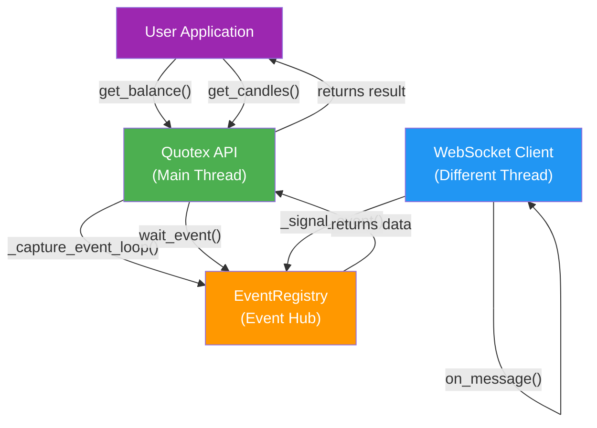

---

## Event Flow: get_balance() Example

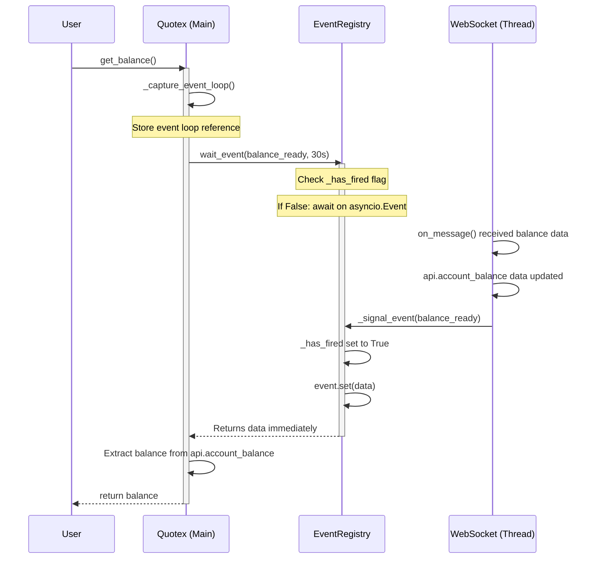

---

## Race Condition Prevention

### Problem: Event Lost Before Wait Starts

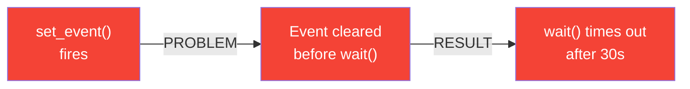

### Solution: _has_fired Flag

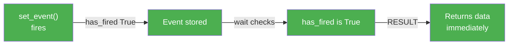

---

## Concurrent Request Handling

### Issue: Multiple Requests for Same Data

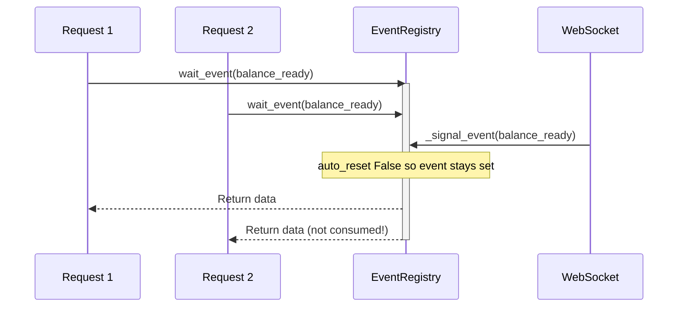

---

## AsyncEvent State Machine

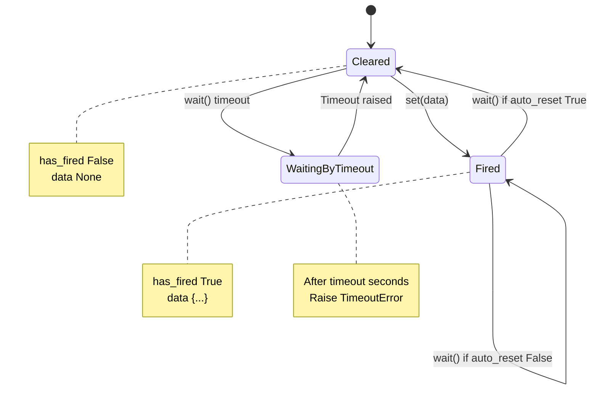

---

## Asset-Specific Events

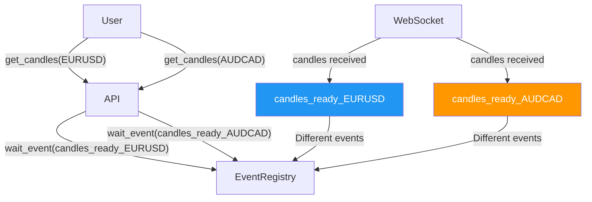

---

## Class Hierarchy

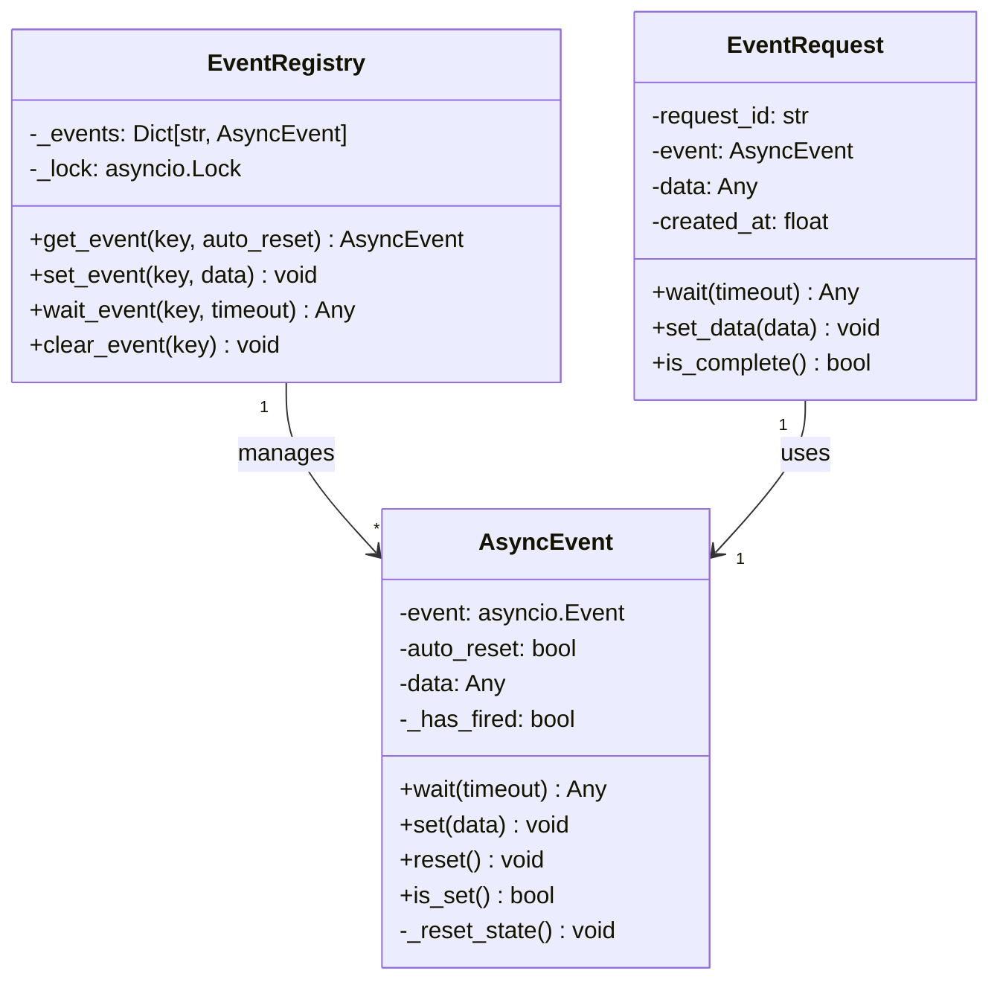

---

## Thread Safety Model

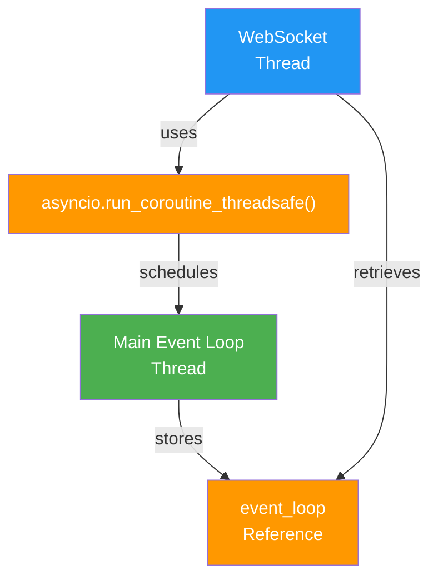

### Thread-Safe Event Signaling

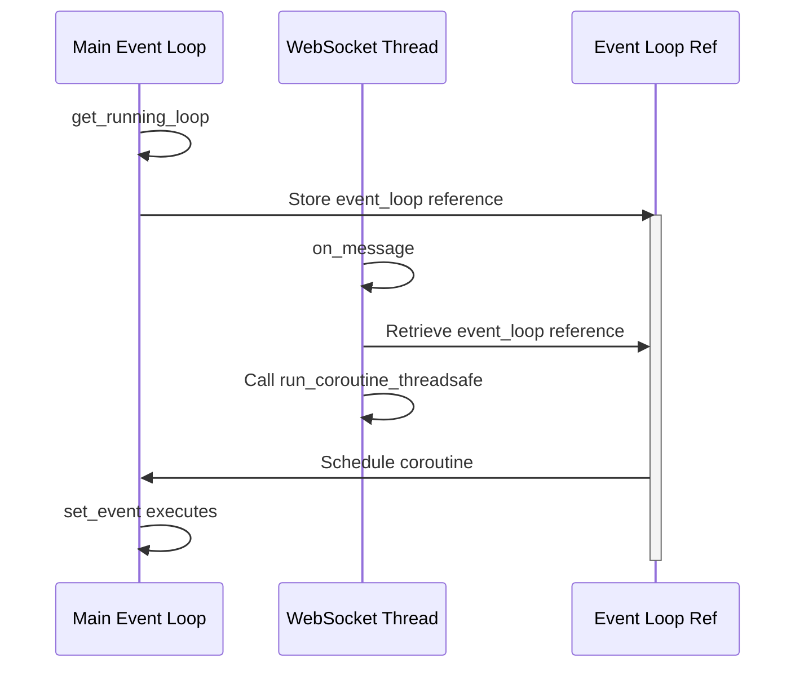

---

## Data Flow: Complete Request Lifecycle

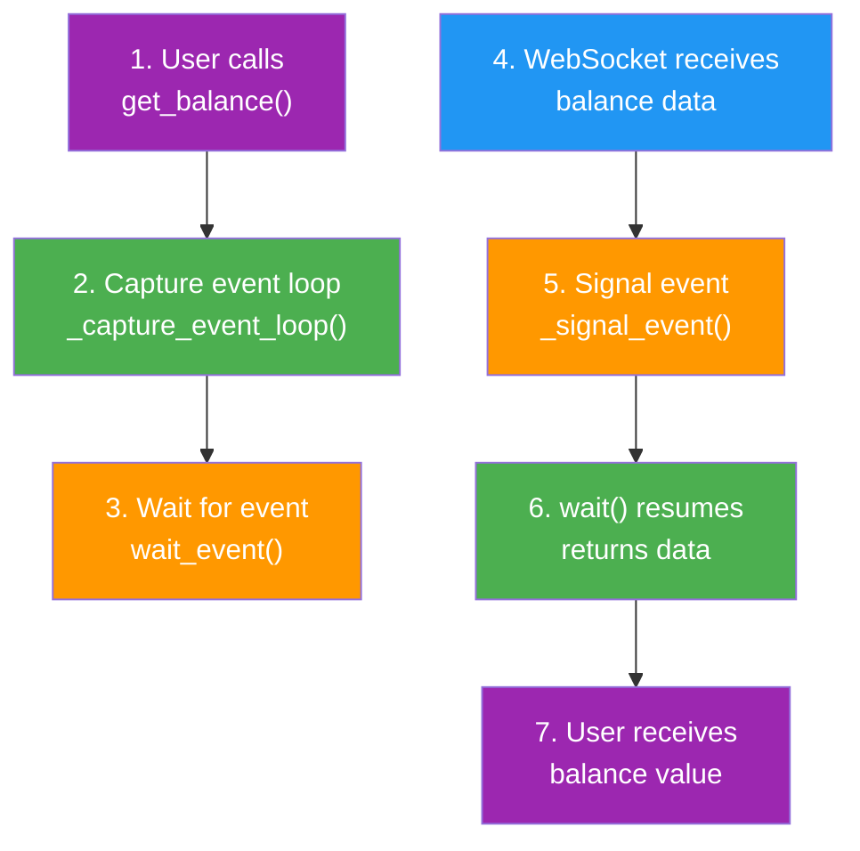

---

## Error Handling

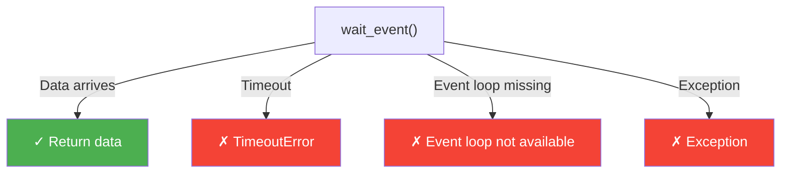

---

## Performance Characteristics

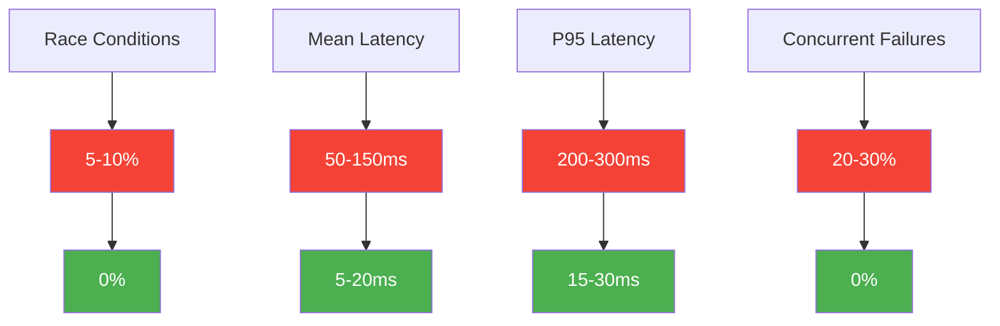

---

## Key Components

### 1. AsyncEvent
- **Purpose**: Base event with race condition prevention
- **Features**: `_has_fired` flag, optional auto-reset, data storage
- **Usage**: Internal building block for EventRegistry and EventRequest

### 2. EventRegistry
- **Purpose**: Manages multiple named events
- **Features**: Thread-safe, auto-creates events, lock-protected
- **Usage**: Global events like `balance_ready`, `instruments_ready`, `candles_ready_EURUSD`

### 3. EventRequest
- **Purpose**: Request-scoped events for future per-request isolation
- **Features**: Unique ID, timestamp, isolated from other requests
- **Usage**: Foundation for advanced concurrency patterns

---

## Best Practices

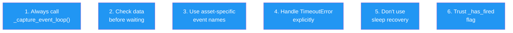

---

## Future Enhancements

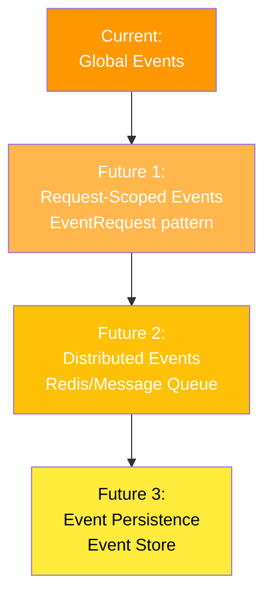

---

## Implementation Files

| File | Purpose |
|------|---------|
| `pyquotex/utils/async_utils.py` | AsyncEvent, EventRegistry, EventRequest classes |
| `pyquotex/ws/client.py` | WebSocket handler, _signal_event() method |
| `pyquotex/stable_api.py` | API methods: get_balance(), get_candles(), get_instruments() |
| `pyquotex/api.py` | Core API class, stores event_loop reference |
| `pyquotex/utils/processor.py` | Candle processing with deduplication |

---

## Summary

The event-driven architecture provides:

**Zero race conditions** - Events can't be lost
**Concurrent request support** - Multiple requests succeed
**Thread-safe signaling** - WebSocket thread safely notifies main loop
**Asset isolation** - Asset-specific event names prevent cross-contamination
**3-10x faster** - No polling, immediate response on data arrival
**Production-ready** - Comprehensive error handling and validation

